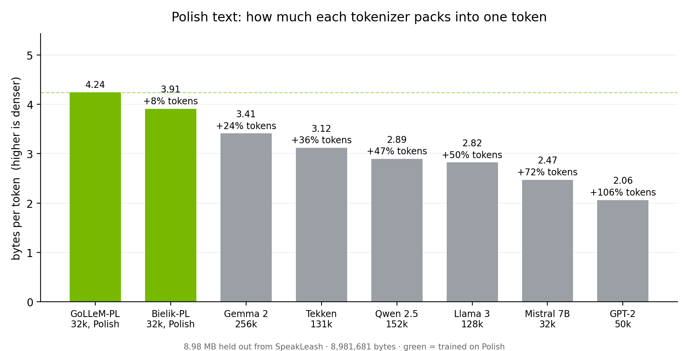

# Polish Tokenization Cost

**How much extra does Polish text cost in open models — and what does a language-specific tokenizer buy you?**

On 9 MB of Polish text, general-purpose tokenizers need between **24% (Gemma 2) and 72% (Mistral 7B)** more tokens than GoLLeM-PL, a 32k tokenizer trained on Polish. Tokens are what a context window holds, what inference throughput is measured in, and what API providers bill for — so a tokenizer that cuts a language finely makes that language more expensive on every one of those axes.




**Disclosure.** GoLLeM-PL is the author's own tokenizer ([tokenizer-pl-32k](https://huggingface.co/KateMajzel/tokenizer-pl-32k)). The table therefore includes a second Polish tokenizer built independently by another team, as a check on whether the effect is specialisation or an artefact of one corpus. This is not a leaderboard: the tokenizers here were built for different languages and different scopes, and the question is what language fit costs, not whose work is better. Everything needed to verify the comparison is in this repository.

---

## Results

Measured on 1,999 documents held out from the SpeakLeash corpus used to train GoLLeM-PL: 8,981,681 bytes, ~1.25M whitespace-separated words.

Composition by bytes: 28% web crawl, 22% encyclopaedic (Polish Wikipedia), 21% literature (Wolne Lektury, Wikisource, CLARIN novels), 16% forum posts, 7% news, 6% academic, under 1% legal. See [Limitations](#limitations) on what "held-out" does and does not mean here, and on how unevenly those bytes are distributed across documents.

| Tokenizer | Vocab | Tokens | Bytes/token | Tokens/word | Overhead |
|---|---:|---:|---:|---:|---:|
| **GoLLeM-PL** (Polish) | 32,768 | 2,117,649 | **4.241** | 1.69 | — |
| [Bielik-PL 11B v3](https://huggingface.co/speakleash/Bielik-PL-11B-v3.0-Instruct) (Polish, independent) | 32,000 | 2,297,003 | 3.910 | 1.84 | +8% |
| Gemma 2 | 256,000 | 2,633,816 | 3.410 | 2.11 | +24% |
| Tekken ¹ | 131,072 | 2,880,858 | 3.118 | 2.30 | +36% |
| Qwen 2.5 | 151,665 | 3,103,076 | 2.894 | 2.48 | +47% |
| Llama 3 | 128,256 | 3,183,356 | 2.821 | 2.55 | +50% |
| Mistral 7B v0.1 ² | 32,000 | 3,636,086 | 2.470 | 2.91 | +72% |
| GPT-2 | 50,257 | 4,355,238 | 2.062 | 3.48 | +106% |

Higher bytes/token means each token carries more text, so fewer tokens for the same content. Overhead is the extra tokens needed for the same 9 MB. All eight reconstruct the input byte for byte.

¹ One tokenizer, three repositories: `mistralai/Mistral-Nemo-Base-2407`, `nvidia/NVIDIA-Nemotron-3-Nano-30B-A3B-BF16`, `CYFRAGOVPL/PLLuM-12B-base-2412`. Their vocabularies were compared directly rather than inferred from matching counts: all 131,064 text tokens carry identical IDs across the three, and only eight control-token slots differ (`[PREFIX]`, `[MIDDLE]`, `[SUFFIX]`, `<pad>` and four `<SPECIAL_n>` in one; `<think>`, `<tool_call>`, `<tool_response>`, `<|im_start|>` and their closers in another). On natural text they tokenize identically, so the table reports one row. Two of the three — Mistral Nemo and PLLuM — have byte-identical vocabularies; only Nemotron differs, and only in those eight slots. `tokenizer_groups.json` records the comparison and `results.json` records each repository separately.

² `speakleash/Bielik-11B-v3.0-Instruct` — distinct from the Bielik-PL variant above — uses this tokenizer plus 128 chat tokens and produces an identical count on this corpus. Both are in `results.json`.

Raw output, including every tokenizer's Hub commit hash, the input hash and the `transformers` version, is in [`results.json`](results.json). GPT-2 is a historical reference rather than a deployment target; the range that matters for current models is 24–72%.

### What stands out

**The gap is language fit, not vocabulary size.** Mistral 7B and GoLLeM-PL have essentially the same vocabulary size — 32,000 against 32,768 — and differ by 72%. Gemma 2's vocabulary is 7.8× larger and still needs 24% more tokens. What a vocabulary was trained on matters more than how large it is.

**Two independent Polish tokenizers agree.** Bielik-PL's tokenizer was built by a different team, on a different pipeline, with different vocabulary construction — and it lands in the same region: more than 14% denser on Polish than any general-purpose tokenizer measured. The 8% between the two of them is noise next to that. Two efforts converging from different directions is the actual result here; neither is a ranking of the other, and the two were built for different scopes.

**One tokenizer can serve many models.** Three of the repositories measured, from three different organisations, share a single vocabulary and merge table down to eight control tokens. This is the ecosystem's default, not anyone's oversight: a tokenizer comes with whatever a model was built on unless someone deliberately replaces it, and replacing it means retraining from scratch. That is precisely why the cost is easy to miss — nobody chose it, it was inherited. A model's name says little about how it segments a given language.

**Nothing here is lossy.** All eight tokenizers reconstruct the text exactly, so none of the overhead comes from dropping or normalising Polish diacritics. The difference is purely how finely each one cuts.

---

## Limitations

**Held-out is not out-of-distribution.** The test slice was not used to train GoLLeM-PL, but it comes from the same corpus family (SpeakLeash) as its training data, so a tokenizer trained on similar text has a natural advantage. This is why a second Polish tokenizer is in the table: it was built by another team on another pipeline and still lands far closer to GoLLeM-PL than to any general-purpose tokenizer, which is what the specialisation claim rests on. The 8% gap between the two Polish tokenizers is not a meaningful ranking — corpus overlap plausibly explains it, and the two were built for different scopes.

**A few documents dominate.** The five largest documents are 27% of the corpus by bytes; three of them are novels — Zola, Dołęga-Mostowicz, Kraszewski — and the second largest is an academic monograph. Some of that literature is in pre-war Polish orthography (*BIBLJOTEKA*, *Illustracyami*), which no modern tokenizer is trained for; this works against the Polish tokenizers rather than for them. The corpus also contains three exact duplicate documents. Aggregate figures over a corpus with this shape should be read as a single point estimate, not a constant.

**Specialisation cuts both ways.** A vocabulary spent on Polish is *worse* than Gemma, Tekken or Qwen on English, code, and every other language. GoLLeM-PL is a better tokenizer *for Polish*, not a better tokenizer. This is a measurement of fit, not of quality.

**Denser tokens are harder tokens.** A tokenizer that packs more text per token asks the model to predict more per step. Fewer tokens does not automatically mean a better or faster model; that is a separate question with a separate experiment behind it (see [Background](#background)). This repository measures tokenization in isolation and makes no claim about downstream model quality.

**Registers are unevenly represented.** Web crawl, encyclopaedic text and literature together are 71% of the bytes; legal text is under 1%. Tokenization density varies by register, so the aggregate reflects this particular mix. Per-register numbers are a natural extension — the script accepts any UTF-8 file.

**Cost depends on how you deploy.** For API users, tokens are the billing unit and the overhead is a direct multiplier at a fixed per-token price — though providers price tokens differently, partly because per-token compute grows with embedding size. For self-hosted models, tokens translate to throughput, context capacity and KV-cache memory rather than to a bill. The optional cost column in the script applies one reference price to every model; it is a normalisation, not a market quote.

**The held-out set is private.** SpeakLeash is public, but this particular 1,999-document sample was drawn during GoLLeM-PL training and is not redistributed here. The hashes and composition breakdown above identify it; any Polish text of similar size and mix should reproduce the ranking.

---

## Reproducing

```bash
pip install -r requirements.txt
python polish_token_tax.py --input heldout.txt --json results.json
```

Or measure your own language — any UTF-8 file works:

```bash
python polish_token_tax.py --input your_corpus.txt
```

**Input file.** `heldout.txt` is the UTF-8 text of the 1,999 held-out documents, concatenated with a single newline between them. Documents contain internal newlines, so this file carries no recoverable document boundaries; `--doc-sep` needs an input written with an unambiguous separator.

SHA-256 as read by the script (8,981,681 bytes; Python normalises CRLF to LF on read):
`f6df196e74b4de596d1f5815adaa4eb567a7aac64b84f1300e02c78345780f54`

SHA-256 of the file on disk (8,981,940 bytes, Windows line endings intact):
`579eeb4c072662639a6ffb1ff02c7a0ba1d2fa26b23da116b0ab73744233ef21`

**Gated repositories.** Several of the tokenizers measured require accepting a licence on their Hugging Face page, then authenticating:

```bash
export HF_TOKEN=hf_your_token
```

Tokenizers that fail to download are skipped with a warning; the rest are measured normally.

**Options**

| Flag | Meaning |
|---|---|
| `--input FILE` | UTF-8 text to measure (falls back to a built-in Polish sample) |
| `--doc-sep SEP` | Treat `SEP` as a document separator and report per-document percentiles. Not used for the run above — see the note on `heldout.txt` |
| `--price USD` | Reference price per 1M tokens for the cost column (default 0.50) |
| `--json FILE` | Write raw results, tokenizer revisions and input hash as JSON |

Tokenizers are configured in the `TOKENIZERS` dictionary at the top of `polish_token_tax.py`; any tokenizer on the Hugging Face Hub can be added.

---

## Method

**Metric: bytes per token.** This measures the tokenizer in isolation. Bits-per-byte is the right metric for comparing *models* with different vocabularies, but it requires a trained model and measures tokenizer and model together. Bytes per token needs only the tokenizer and answers one question: how much text does each unit carry.

**One text, many tokenizers.** All tokenizers see byte-identical input, so no normalisation is needed. Special tokens are excluded (`add_special_tokens=False`) to measure the tokenizer rather than the chat template.

**Words.** "Word" means a whitespace-separated token (`str.split()`), so tokens/word counts punctuation attached to words as part of the word. It is a convenience figure; bytes/token is the primary metric and does not depend on this definition.

**Vocabulary size** is `len(tokenizer)`, which includes added special tokens. Some models pad their output embedding matrix beyond this — Qwen 2.5's is 152,064 against a tokenizer vocabulary of 151,665 — but the tokenizer figure is what determines segmentation.

**Round-trip verification.** Every tokenizer is checked for exact `decode(encode(text)) == text` reconstruction.

**Shared-tokenizer detection.** Where two repositories produce identical token counts, their `tokenizer.json` files are compared at the vocabulary and merge-rule level, so a shared tokenizer is distinguished from a coincidence rather than assumed. Both groups collapsed in the table above were confirmed this way; the comparison is in `tokenizer_groups.json`, and `verify_tokenizers.py` regenerates it. Each group records how many tokens all its repositories share and how many of those carry the same ID everywhere — 131,064 of 131,064 for Tekken, 32,000 of 32,000 for the Mistral 32k pair. Every repository is also fingerprinted by a hash of its token-to-ID mapping, so two repos that are secretly the same tokenizer, or one that silently redirects elsewhere, show up rather than being taken on trust.

Merge rules are compared as sets rather than as ordered lists. Different versions of the `tokenizers` library serialise merges differently — as `"▊t he"` in one format and `["▊th", "e"]` in another — and order equal-priority pairs inconsistently between them, which changes the file without changing the tokenizer. Every repository in both groups shares its merge set exactly, and its vocabulary apart from the eight control slots noted above; the artefact records `same_merges_as_list` alongside `same_merges_as_set` so the one case where file order differs is visible rather than hidden.

---

## Files

| Path | Contents |
|---|---|
| Path | Contents |
|---|---|
| `polish_token_tax.py` | Measurement script |
| `results.json` | Raw output from the run reported above, every repository listed separately |
| `verify_tokenizers.py` | Repository identity check and shared-ID evidence; regenerates `tokenizer_groups.json` |
| `tokenizer_groups.json` | Vocabulary and merge-rule comparison for repositories with identical counts |
| `shared_id_evidence.json` | How many tokens each collapsed group shares, and how many carry the same ID everywhere |
| `make_chart.py` | Regenerates `density.png` from `results.json` |
| `density.png` | Bytes-per-token chart shown at the top of this README |
| `requirements.txt` | Pinned Python dependencies |
| `k8s/nim-nemotron.yaml` | GKE deployment manifest for a Nemotron NIM |
| `docs/nim-on-gke.md` | Notes from deploying Nemotron NIM on Google Kubernetes Engine — a separate exercise from the tokenizer measurement, and on a different model from the one in the table |

## Background

This work rests on Polish open-source infrastructure: the [SpeakLeash](https://speakleash.org/) corpus that both the measurement and the tokenizer are built on, and the Bielik and PLLuM projects, which are why open Polish models exist to measure at all.

GoLLeM-PL comes from [GoLLeM-45M-PL](https://huggingface.co/KateMajzel/GoLLeM-45M-PL), a 45M-parameter Polish model trained from scratch as a controlled tokenizer ablation. That experiment measured the downstream effect — what a Polish tokenizer does to model quality per unit of compute — and its results are on the model card. This repository isolates the narrower, model-free question: how much of the cost of Polish in general-purpose models is attributable to tokenization alone.

## Licence

Code and text in this repository: MIT. The SpeakLeash corpus is distributed under its own terms and is not included here.
